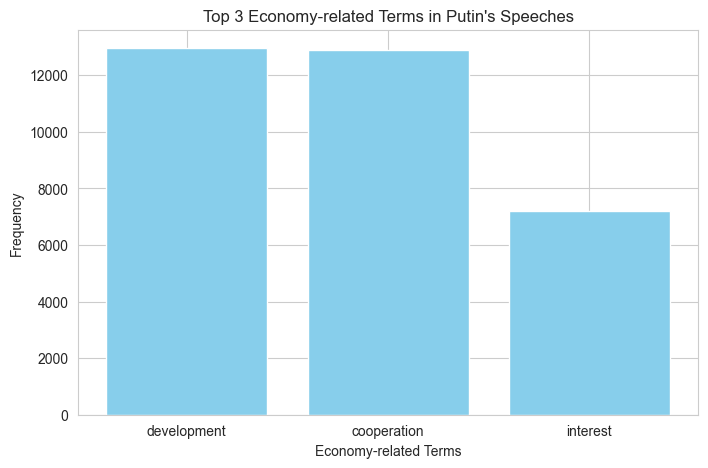
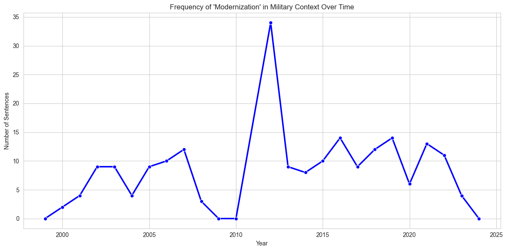
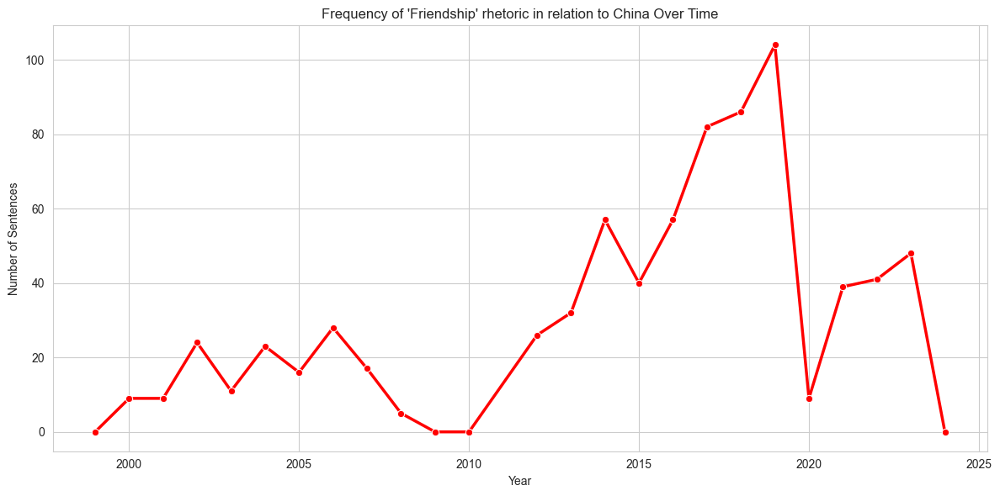
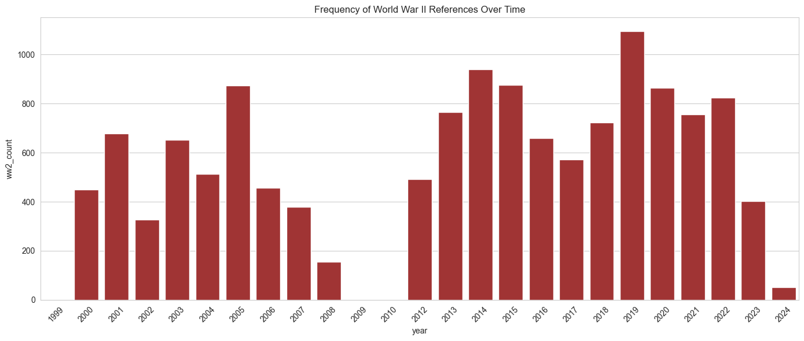
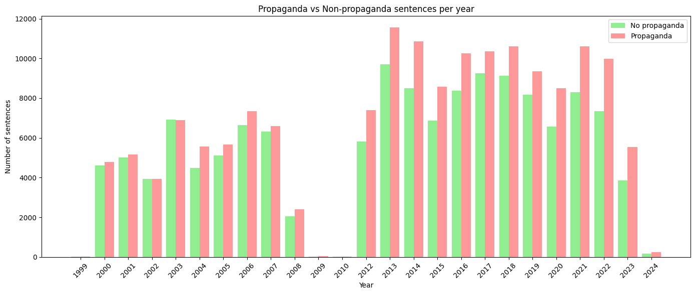
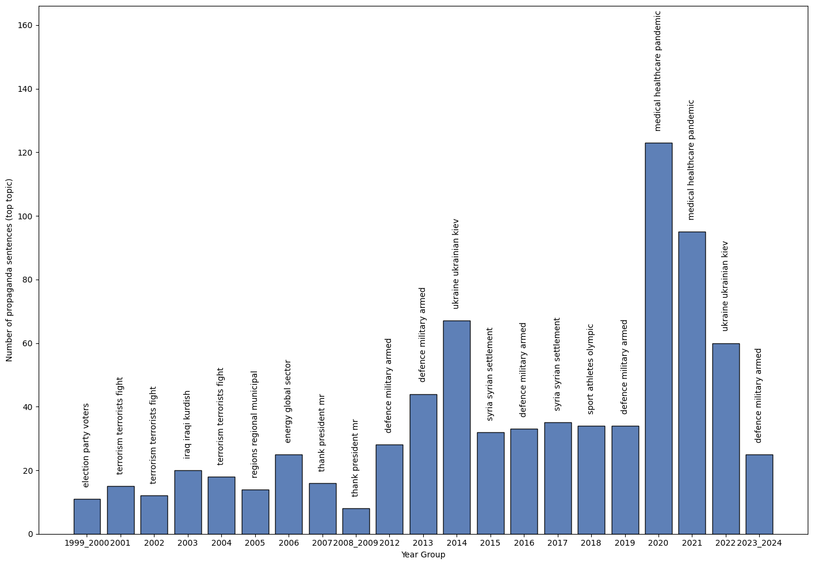
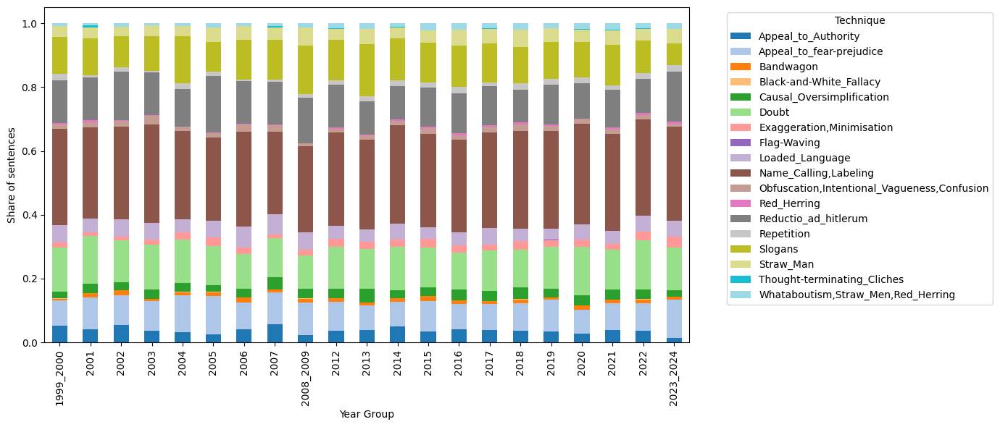

# Word frequency analysis and Propaganda detection in Putin's speeches

This repository contains my contribution to a larger group project analyzing the Putin Corpus dataset. My specific tasks involved conducting word frequency analysis and detecting propaganda in the speeches, as well as comparing these statistical methods with the performance of the TinyLlama1B model.
Dataset used in the project: https://drive.google.com/file/d/1Of3e_pz-01IqslaIk6pTlVtPn7p4zx9z/view

## Word frequency analysis

To answer specific statistical questions, I applied word frequency analysis along with custom lexicons to find mentions of various concepts. I counted occurrences of individual words (like economic terms) and co-occurrences of words from different lexicons within the same sentence (e.g., "friendship" and "China"). 

I then compared these results with the answers generated by TinyLlama1B, which was the least effective LLM on our statistics tasks. 

Key findings from this part:
* **Economy-related terms:** The analysis showed that "development", "cooperation", and "interest" are the most frequent economic terms in the dataset. TinyLlama1B failed this task, providing completely incorrect words.
* **Modernization in a military context:** I tracked this over time, revealing a clear peak in 2012. 
* **Friendship in relation to China:** Monitored for temporal patterns. For this question, TinyLlama1B actually did well, correctly identifying the context and providing historical background.
* **World War II mentions:** Tracked frequency across different years. TinyLlama1B didn't give a specific count but correctly noted the context.

### Three most frequent economy-related words.

### Modernization mentions in military context over time.

### Friendship mentions related to China over time.

### World War II mentions over time.

## Propaganda detection

For the second part of my work, I analyzed the entire corpus of speeches to detect propaganda. I used the NCI Binary Propaganda Detector v2 (based on ModernBERT-base). After identifying propaganda content, I filtered the dataset to keep only those sentences to see how topics and techniques shifted over time.

Overall, about 54% of the speeches were classified as propaganda. In almost every year, propaganda sentences outnumbered regular ones. The gap was especially large between 2012 and 2024, during Putin’s second presidential period.

## Number of propaganda and non-propaganda sentences over time.

### Propaganda topic modeling

I wanted to find the dominant topic for each year. To do this, I used only high-confidence propaganda sentences (prediction score > 0.9). I generated sentence embeddings using the all-MiniLM-L6-v2 model and ran topic modeling with BERTopic. 

The topics I found closely followed real-world events:
* **2000:** Election-related topics (when Putin first took office)
* **2014 & 2022:** Ukraine-related topics (Donbas conflict and the full-scale invasion)
* **2015:** Syria-related topics (Russian military intervention)
* **2020-2021:** Pandemic-related topics

## Dominant propaganda topic over time.

### Propaganda techniques

Finally, I analyzed the specific propaganda techniques used in those sentences over time using the NCI Technique Classifier (ModernBERT-base).

The most dominant technique across all years was name-calling and labeling. Other common techniques included slogans, reductio ad Hitlerum, doubt, and appeals to fear or prejudice. 

## Dominant propaganda technique used over time.

